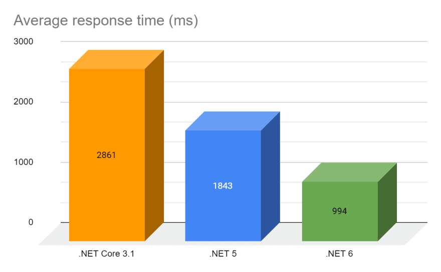

 

  
   
  

  Dotnet 6 e suas novidades, esta aplicação   é apenas um exemplo de uso ⚡️
  

  
 
    <a href="https://dotnet.microsoft.com/en-us/download/dotnet/6.0">SDK Dotnet 6</a>
    ·
    <a href="https://dotnet.microsoft.com/en-us/learn/dotnet/in-browser-tutorial/1">Tutoria in-Browser</a>    
  

 

# Algumas Novidades do framework

## Minimals Api

Com o minimal api podemos criar nossas apis de forma mais simplificadas como um script, igual ao node e python não dependendo mais criar classes verbosas para implementar as controllers

## File-scoped namespaces

Agora as estruturas não precisam mais estar entrelaçadas aos namespace, basta apenas declarar a namespace que tudo que estiver abaixo já estará incluso ao namespace.

## Global Using

com o global using podemos setar bibliotecas ou classes de forma global, não tendo que em todo arquivo use o using para poder usar os recursos da bibliotecas

## Suporte Hot-Reload

no dotnet 6 podemos agora alterar o código em tempo de compilação e submeter instantaneamente, bem parecido com o nodemon para quem conhece node

## Melhoria em performance

O dotnet 6 se mostrou bem mais rápido que o dotnet 5 e o dotnet core 3.1

tivemos melhorias em rapides do MSBuild, no startup da aplicação e no
dotnet cli

## Suporte de 3 anos

O dotnet 6 terá suporte de até três anos após o lançamento, como parte de seu LTS.

## O suporte a processadores também melhorou nesta nova versão

Com as novidades, chega também o suporte ao novo Apple Silicon M1, sendo que o .Net é o primeiro framework a receber seu emblema de portabilidade, mesmo estando em alpha-1.

O suporte a ARM64 também melhorou, isso se mostra na utilização de containers do dotnet cli e em novas APIs para utilização com matemática.

## Sobre Entity Framework Core 6

EF Core agora dá suporte a:

- A criação de tabelas temporais usando Migrações;
- Transformação de tabelas existentes em tabelas temporais, novamente usando Migrações;
- Consultando dados históricos;
- Restaurando dados de algum ponto no passado.

## melhorias em LINQ

- Melhorias: Index, Ranges, FirstOrDefault, LastOrDefault, SingleOrDefault,
- Novos metodos: MaxBy, MinBy, UnionBy, IntersectBy,ExceptBy e DistinctBy
